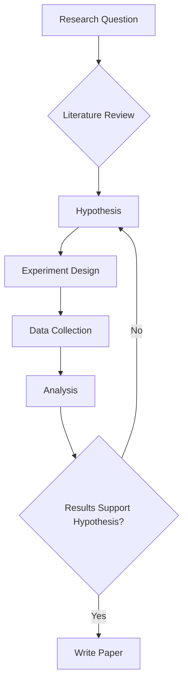

Welcome to my blog! I'll be writing about AI, machine learning, and life here.

## Math Support

This blog supports LaTeX math rendering via MathJax. Here's an example:

Inline math: $E = mc^2$

Display math:

$$
\nabla \times \mathbf{E} = -\frac{\partial \mathbf{B}}{\partial t}
$$

The Gaussian integral:

$$
\int_{-\infty}^{\infty} e^{-x^2} dx = \sqrt{\pi}
$$

## Mermaid Diagrams

This blog also supports Mermaid diagrams. Here's an example flowchart:



## Code Highlighting

Code blocks with syntax highlighting are also supported:

```python
import numpy as np

def gaussian(x, mu=0, sigma=1):
    """Compute the Gaussian function."""
    return (1 / (sigma * np.sqrt(2 * np.pi))) * np.exp(-0.5 * ((x - mu) / sigma) ** 2)
```

## What's Next

Stay tuned for posts about my research in AI for healthcare and other topics.
